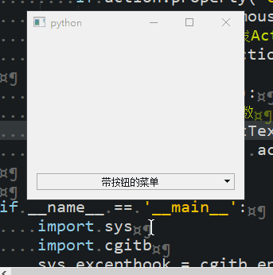

# QMenu

## 1、菜单设置多选并且不关闭
[运行 MultiSelect.py](MultiSelect.py)

有时候会遇到这种需求：在界面某个位置弹出一个菜单，其中里面的菜单项可以多选（类似配置选项），
此时用QMenu会遇到点击一个菜单项就会自动关闭，当然可以通过其他方式实现该功能，
不过这里就采用QMenu通过特殊的方式来实现该需求。

需求：显示4个菜单（菜单1、菜单2、菜单3、菜单4），
其中点击菜单1、2、3可以多选不关闭菜单，
点击菜单4可以勾选，并且关闭菜单

原理：

1. 设置菜单项可勾选：通过`QAction.setCheckable(True)`方法实现
2. 设置菜单不可关闭：通过覆盖`QMenu`的鼠标释放`mouseReleaseEvent`方法（可直接替换或者通过`installEventFilter`安装事件过滤器实现）
3. 在菜单的鼠标释放事件中，当点击菜单项后是通过点击点坐标来查找是否有`QAction`，然后触发对应的`QAction`
4. 故在没有`QAction`的地方则直接交还给`QMenu`自行处理逻辑，在有`QAction`的地方可以根据自己的需求进行处理（如上所提）

核心代码：

```python
def _menu_mouseReleaseEvent(self, event):
    action = self._menu.actionAt(event.pos())
    if not action:
        # 没有找到action就交给QMenu自己处理
        return QMenu.mouseReleaseEvent(self._menu, event)
    if action.property('canHide'):  # 如果有该属性则给菜单自己处理
        return QMenu.mouseReleaseEvent(self._menu, event)
    # 找到了QAction则只触发Action
    action.activate(action.Trigger)
```

